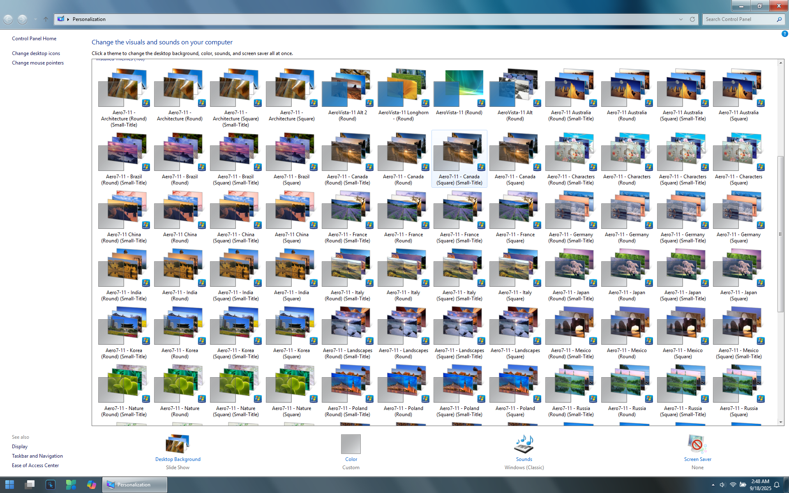

## Optional Extras
This folder contains additional themes and resources that you can explore to further customize your Windows 11 experience with the Aero7-11 theme.

### Themes
The `Themes` folder includes a variety of additional themes inspired by Windows 7 and Windows Vista. You can copy these themes to `%SYSTEMROOT%\Resources\Themes` to use them alongside the Aero7-11 theme. The included themes are:

### Classic Personalization Menu
To enhance your personalization experience, you can enable the Classic Personalization Menu. This can be done by using the registry files provided in the `Classic Personalization Menu` folder. Simply run the appropriate `.reg` file to enable or disable the classic menu.

### Additional Resources
The following resources are provided via seperate repositories but may be useful with Aero7-11. Some of these may or may have issues on Windows 11 24H1+. Use these at your own risk.

- [Explorer7](https://github.com/world-windows-federation/explorer7): A Windows Explorer modification that brings back the classic Windows 7 Explorer look and feel to Windows 10/11.
- [StartAllBack](https://www.startallback.com/): A third-party application that allows you to customize the Start Menu and Taskbar to resemble Windows 7. It offers various themes and customization options.
- [OldNewExplorer](https://www.msfn.org/board/topic/170375-oldnewexplorer-v1909-for-windows-10-1809-1903-1909-2004-20h2-21h1-21h2/): A tool that modifies Windows Explorer to bring back the classic Windows 7 style. It includes options to customize the navigation pane, toolbar, and other elements.